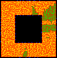
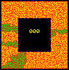

# AoC19

Advent of Code 2019 solutions https://adventofcode.com/2019

## Installation

```cmd
py -m venv p38
p38/scripts/activate
pip install -r requirements.txt
```

## Usage

```cmd
py dayxx.py
```

## Notes

* Utils - general purpose / multi-day utils including the IntCode Computer

## Key Lessons

Day | Part | Notes
--- | ---- | -----
19 | | Used a monochrome bitmap image to store 10000x10000 booleans good for time, great for visualisation!
20 | | breadth first search with 3 dimensions not much trickier than two - color image for nicer mapping, gif for 3d!
20 | 1 | 
20 | 2 | 
22 | 1 | Slicing a list was easy enough :)
22 | 2 | Brute force results in MemoryError.  I gave up, this was way above my maths capabilities so I stole a [solution](https://github.com/metalim/metalim.adventofcode.2019.python/blob/master/22_cards_shuffle.ipynb). The concept of turning the whole script into a single linear time function was interesting, but it doesn't work on part1...